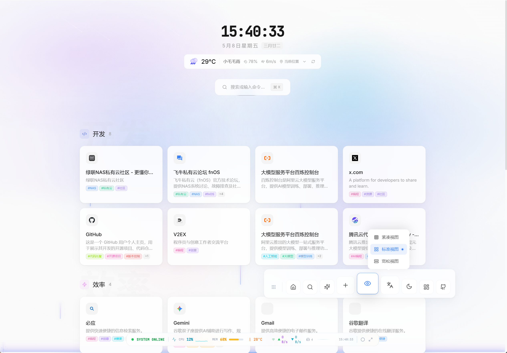
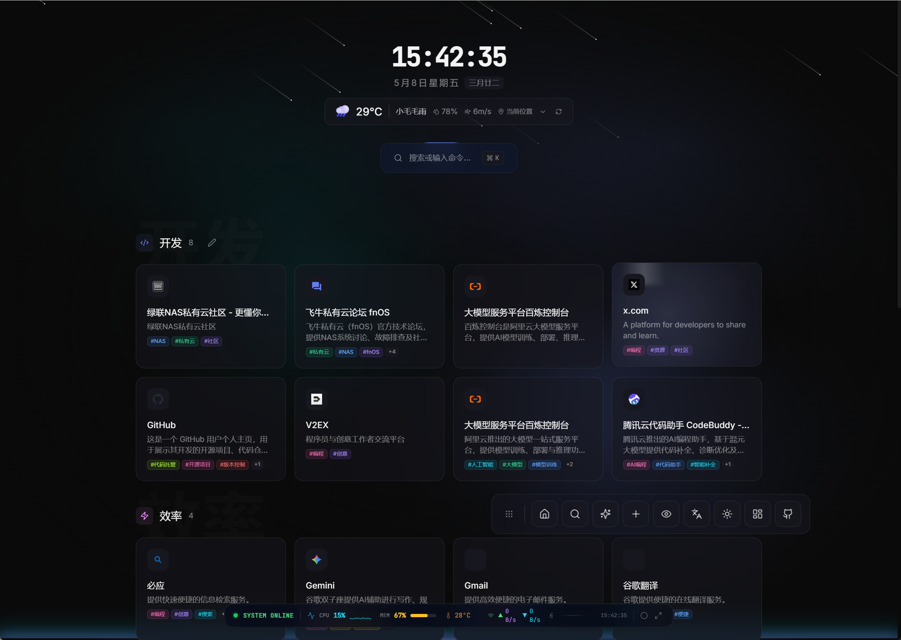
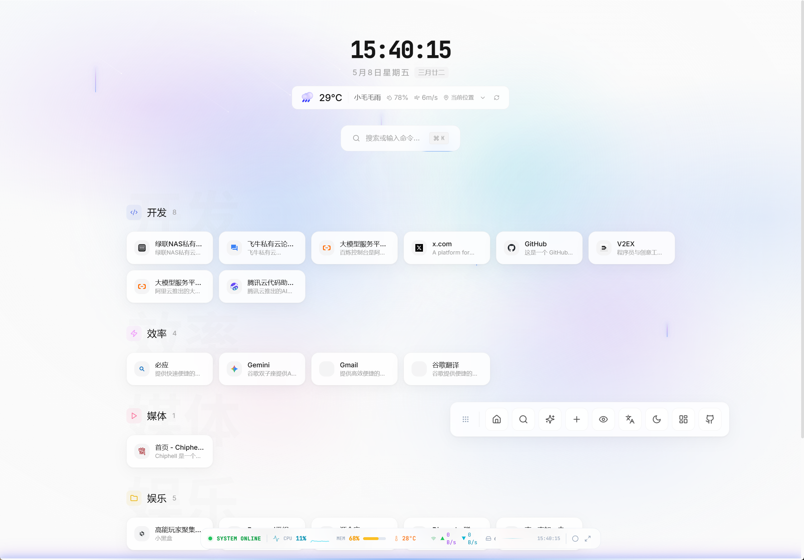
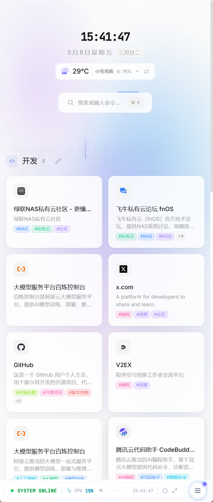
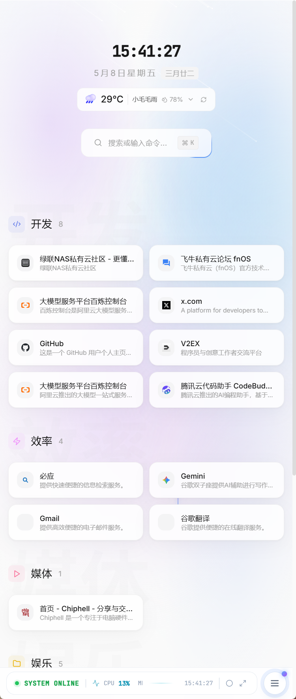
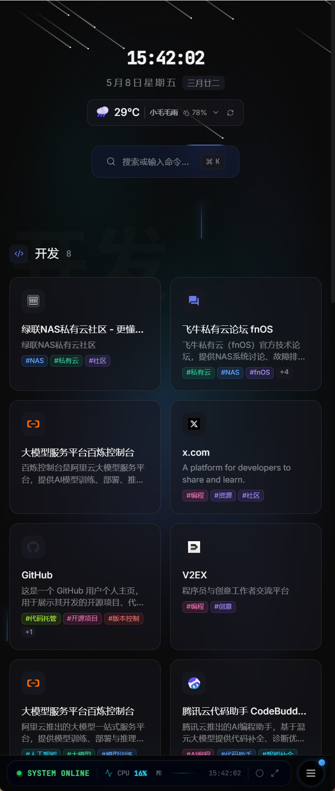
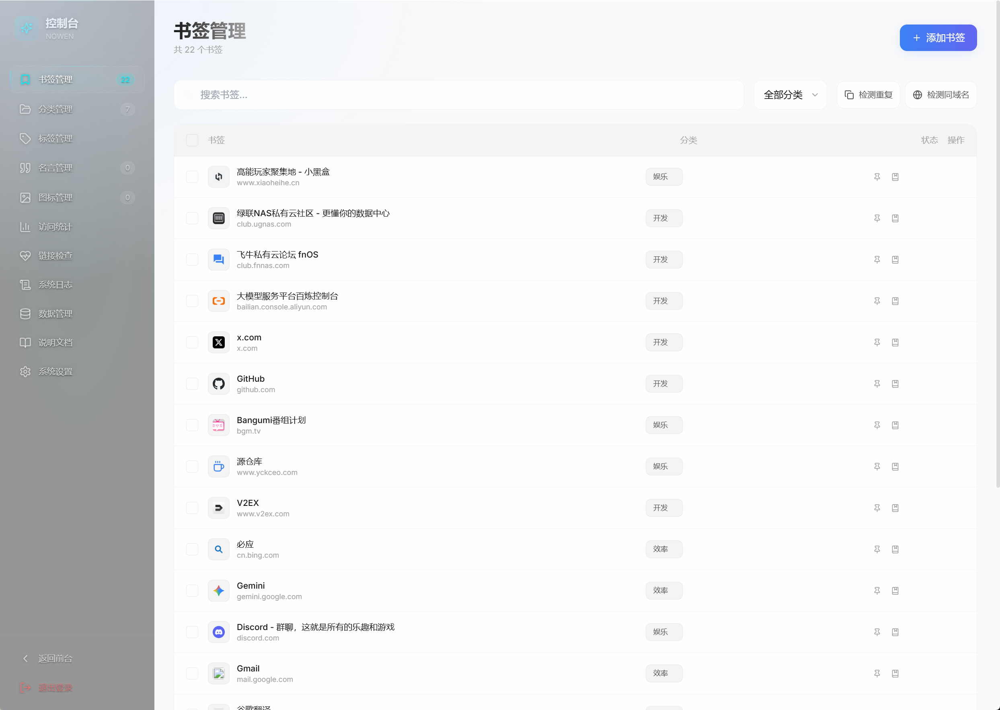
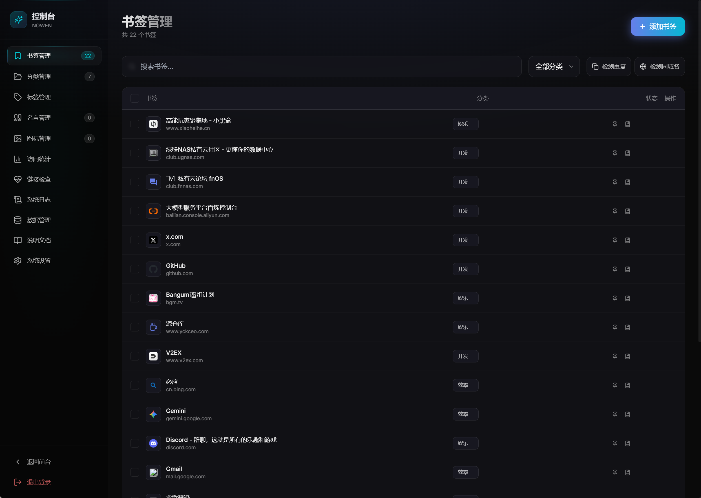
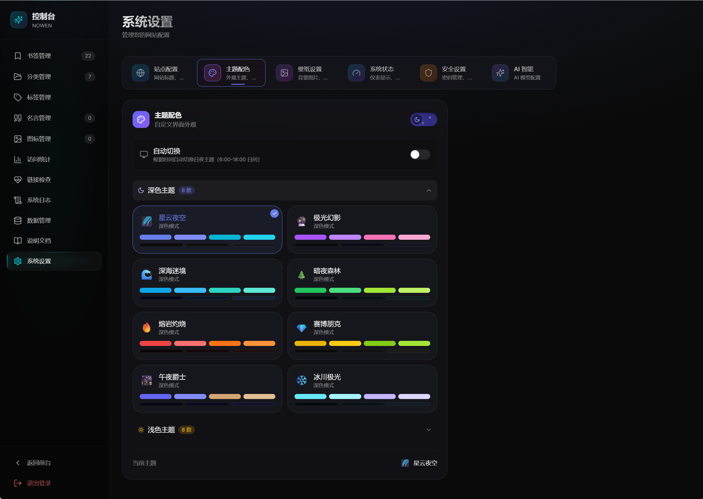

<div align="center">

# NOWEN · 弄文 · 星云门户

集书签管理与系统监控于一体的极简个人导航站。

[](./LICENSE)
[](https://nodejs.org/)
[](https://react.dev/)
[](https://www.typescriptlang.org/)
[](https://hub.docker.com/r/cropflre/nowen)

[English](./README_EN.md) · [简体中文](./README.md)

</div>

---

## ✨ 特性

- 📚 **书签管理** — 拖拽排序、分类标签、置顶 / 稍后阅读、AI 自动元数据与标签
- 🖥️ **系统监控** — CPU / 内存 / 硬盘 / 网络 / 温度 / Docker 容器实时状态
- 🔍 **Spotlight 搜索** — `⌘/Ctrl + K` 全局搜索，支持书签和命令
- 🎨 **主题系统** — 8 款预设主题，深 / 浅双模式，跟随系统或时间自动切换
- 🌐 **国际化** — 中文 / English / 日本語 / 한국어
- 💾 **数据安全** — Named Volume + 多层备份机制，支持 WebDAV 云备份
- 🚀 **多架构支持** — x86_64 / ARM64（适配树莓派、RK3588 等开发板）
- 📱 **响应式** — 桌面 Dock 与移动端悬浮坞，触觉反馈

## 📸 预览

### 🖥️ 桌面端

<table>
  <tr>
    <td align="center"><b>日间模式</b></td>
    <td align="center"><b>夜间模式</b></td>
  </tr>
  <tr>
    <td></td>
    <td></td>
  </tr>
  <tr>
    <td align="center" colspan="2"><b>Dock 视图切换</b></td>
  </tr>
  <tr>
    <td colspan="2"></td>
  </tr>
</table>

### 📱 移动端

<table>
  <tr>
    <td align="center"><b>日间模式</b></td>
    <td align="center"><b>日间模式（详情）</b></td>
    <td align="center"><b>夜间模式</b></td>
  </tr>
  <tr>
    <td></td>
    <td></td>
    <td></td>
  </tr>
</table>

### 🛠️ 后台管理

<table>
  <tr>
    <td align="center"><b>书签管理（日间）</b></td>
    <td align="center"><b>书签管理（夜间）</b></td>
  </tr>
  <tr>
    <td></td>
    <td></td>
  </tr>
  <tr>
    <td align="center" colspan="2"><b>主题配色（8 款深色 + 8 款浅色）</b></td>
  </tr>
  <tr>
    <td colspan="2"></td>
  </tr>
</table>

## 🚀 快速开始

### Docker（推荐）

```bash
docker run -d \
  --name nowen \
  -p 3000:3000 \
  -v nowen-data:/app/server/data \
  -v nowen-backup:/app/.data-backup \
  --restart unless-stopped \
  cropflre/nowen:latest
```

打开 <http://localhost:3000>，使用默认账号登录：

| 用户名 | 密码 |
| ------ | -------- |
| admin  | admin123 |

> ⚠️ 首次登录后请立即修改默认密码。

### Docker Compose

```yaml
services:
  nowen:
    image: cropflre/nowen:latest
    container_name: nowen
    ports:
      - "3000:3000"
    volumes:
      - nowen-data:/app/server/data
      - nowen-backup:/app/.data-backup
    restart: unless-stopped

volumes:
  nowen-data:
  nowen-backup:
```

```bash
docker compose up -d
```

### 本地开发

```bash
# 克隆并安装
git clone https://github.com/cropflre/NOWEN.git
cd NOWEN
npm install
cd server && npm install && cd ..

# 启动后端（端口 3001）
cd server && npm run dev

# 启动前端（端口 5173，新终端）
npm run dev
```

## 🛠️ 技术栈

**前端**：React 18 · TypeScript · Vite · Tailwind CSS · Framer Motion · @dnd-kit · SWR · i18next

**后端**：Express · sql.js (SQLite) · systeminformation · Cheerio · WebDAV · node-cron

**部署**：Docker（多架构）· Nginx · GitHub Actions

## ⌨️ 快捷键

| 快捷键 | 功能 |
| ------ | ---- |
| `⌘/Ctrl + K` | Spotlight 搜索 |
| `⌘/Ctrl + N` | 新建书签 |
| `Esc` | 关闭弹窗 |
| `↑ ↓` / `Enter` | 列表导航 / 确认 |

## 📦 数据持久化

数据库位于容器内 `/app/server/data/zen-garden.db`。建议保留默认的 Named Volume 配置，配合 8 层防呆机制（双卷互备、启动备份、运行时同步、SQLite 完整性校验等）保证数据安全。

也可在后台启用 **WebDAV 云备份**（坚果云 / 群晖 / Alist 等）实现定时异地备份。

## 📡 API 文档

REST API 详情见 [`server/`](./server) 目录下的路由代码，主要包含：

- `/api/bookmarks` — 书签 CRUD、标签、批量操作
- `/api/categories` — 分类管理
- `/api/admin` — 登录、修改密码 / 用户名
- `/api/system` — 实时硬件监控数据
- `/api/visits` — 访问统计
- `/api/health-check` — 链接健康检测
- `/api/backup` — 备份与 WebDAV
- `/api/ai` — AI 标签 / 分类 / 元数据

## 🤝 贡献

欢迎 Issue 和 Pull Request！

1. Fork 本仓库
2. 新建特性分支 `git checkout -b feat/your-feature`
3. 提交更改 `git commit -m 'feat: ...'`
4. 推送 `git push origin feat/your-feature`
5. 发起 Pull Request

## 💬 反馈

- 提交 [Issue](https://github.com/cropflre/NOWEN/issues)
- QQ 群：`1093473044`

## ☕ 赞赏

如果这个项目帮你节省了时间，欢迎请作者喝杯咖啡 / 买把键盘 / 修个 Bug 🙌

<p align="center">
  
</p>

## 📄 许可证

[MIT](./LICENSE) © cropflre

<div align="center">

如果这个项目对你有帮助，欢迎点个 ⭐ Star 支持一下。

</div>
